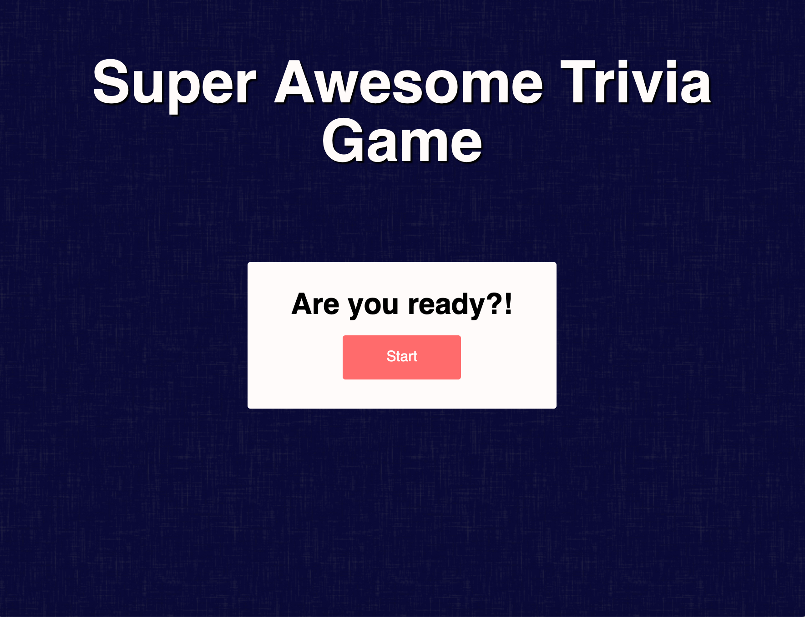

# Trivia App in Vanilla JS
**This project is automatically deployed with commits here: [Live Project](https://elastic-curie-7b6550.netlify.app/)**

# Table of Contents
- [Description](#Description)
- [Process](#Process)
- [Project Brief ](#goal)
    * [Assumptions](#Assumptions)
    * [Acceptance Criteria](#Acceptance-Criteria)

- [Installation](#Running)
- [How it works](#How-it-Works)
- [Features to be Added](#Features-to-be-Added)
- [Quirks](#Quirks)
- [Technologies](#Technologies)

## Description
This project was built as part of the application process for the position of Apprentice Software Engineer at Tandem. The application process opened on Monday, October 26, 2020 and closed Sunday, November 1, 2020 at 11:59 PM CST. 

## Process
I found this position on the evening of the 28th and with the deadline fast approaching, I chose to build the project in Vanilla JavaScript and HTML/CSS. I made this decision because I have spent a lot of time working with JavaScript fundamentals and knew this was the fastest way for me to get the project up and running while also looking nice.

## Project Brief
### Goal
> **Your goal is to create an application that displays trivia questions with multiple-choice answers to select from.**  
> Use creative license in terms of how you want us to see this game. At minimum, the player can view the question(s), the answer choices, the correct answer upon submission, and their score. It could be a user interface (UI), command-line-tool, etc. Feel free to use whatever framework or language you are comfortable with.

### Assumptions
- A round of trivia has 10 Questions
- All questions are multiple-choice questions
- Your score does not need to update in real time
- Results can update on form submit, button click, or any interaction you choose
- Trivia data such as the questions, correct and incorrect answers provided via a JSON file
### Acceptance Criteria
- [X] A user can view questions.
- [X] Questions with their multiple choice options must be displayed one at a time. 
- [X] Questions should not repeat in a round.
- [X] A user can select only 1 answer out of the 4 possible answers.
- [X] The correct answer must be revealed after a user has submitted their answer. A user can see the score they received at the end of the round

## Running the Project Locally

**Installation and Usage:**
1. Clone the project
    - To clone this project, follow these instructions: [GitHub Documentation](https://docs.github.com/en/free-pro-team@latest/github/creating-cloning-and-archiving-repositories/cloning-a-repository)
2. Make sure you have Node.js downloaded: 
    - In the command line(CMD) `node -v`
    - If not you can download it here [Node.js](https://nodejs.org/en/download/)
3. In CMD run
     - `npm install http-server -g`
4. Navigate to the project folder in the CMD and run
    - `http-server`
    - This will start a local server
    - Copy the http address listed in the command line and paste into your browser
    - Run the index.html file to start the app

**Alternatively**
- After cloning the project in step 1, you can use the Live Server extension in VSCode to run the project from the index.html file. [Extension](https://marketplace.visualstudio.com/items?itemName=ritwickdey.LiveServer)

## How it Works

- The start button initializes 10 random questions from a question bank. 
- Users can only select one answer and when submitted they are provided realtime feedback on the answer choice.
- If no answer choice is selected users see feedback that prompts them to make a choice
- At the end of the round scores are compared in local storage to previous high scores. A user can choose to start another game to try to beat the score or clear all previous results.

## Features to be Added

- Unit tests
- Build with React
- Improve accessibility of Trivia App 
- Ability to skip question and have it repeated at the end
- Prevent page refresh once Trivia App is started (no cheating!)
- Connect to database and allow for a leaderboard 

## Quirks
- Currently users can continue to click answer choices and see highlighting of what is selected. I would like to remove this after answer submission. 

## Technologies
- JavaScript
- HTML
- CSS
- Hosted on Netlify
